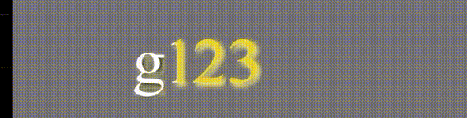
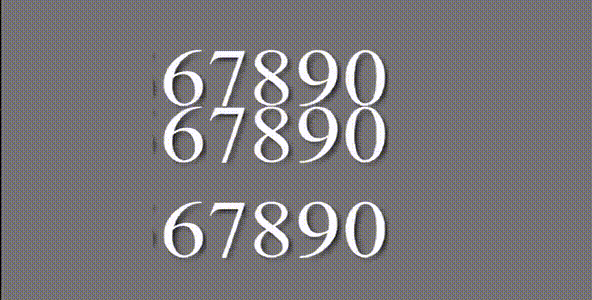

# postto-text
C++调用opengl es实现跨平台文字动画渲染引擎(当前适配iOS,windows)，由于归属问题(17年为公司短视频编辑APP开发的SDK，已停止运营和开发)，目前仅开放SDK使用
使用json配置文件，配置出位移、重影、描边、旋转等文字动画，支持并行、串行、组合动画，json内部支持表达式、引用内部变量、自定义变量、条件判断等扩展功能。

## 使用文档
[配置文件说明](document/reference.md)

## demo
### barrage
水平移动+弹跳弹幕
[配置文件](SwiftContainer/SwiftContainer/effects/barrage/package.json)

### drama
戏剧抖动效果
[配置文件](SwiftContainer/SwiftContainer/effects/drama/package.json)

### illusion
重影
[配置文件](SwiftContainer/SwiftContainer/effects/illusion/package.json)

### jelly
弹性果冻效果
[配置文件](SwiftContainer/SwiftContainer/effects/jelly/package.json)

### outline
描边效果
[配置文件](SwiftContainer/SwiftContainer/effects/outline/package.json)

### parallel
水平切割效果
[配置文件](SwiftContainer/SwiftContainer/effects/parallel/package.json)

### reader
逐字阅读效果
[配置文件](SwiftContainer/SwiftContainer/effects/reader/package.json)

### test_alpha_anim
测试：透明度
[配置文件](SwiftContainer/SwiftContainer/effects/test_alpha_anim/package.json)

### test_composite_anim
测试：复合动画
[配置文件](SwiftContainer/SwiftContainer/effects/test_composite_anim/package.json)

### test_key_tex
测试：自定义纹理贴图
[配置文件](SwiftContainer/SwiftContainer/effects/test_key_tex/package.json)

### test_lines
测试：多行文字不同动画
[配置文件](SwiftContainer/SwiftContainer/effects/test_lines/package.json)

### test_rotate_anim
测试：旋转测试
[配置文件](SwiftContainer/SwiftContainer/effects/test_rotate_anim/package.json)

### test_rotate_anim
测试：描边+位移
[配置文件](SwiftContainer/SwiftContainer/effects/test_tex_anim/package.json)

### test_trans_anim
测试：切割+贝塞尔曲线控制点
[配置文件](SwiftContainer/SwiftContainer/effects/test_trans_anim/package.json)

### test_y_rotate
测试：Y轴旋转
[配置文件](SwiftContainer/SwiftContainer/effects/test_y_rotate/package.json)

